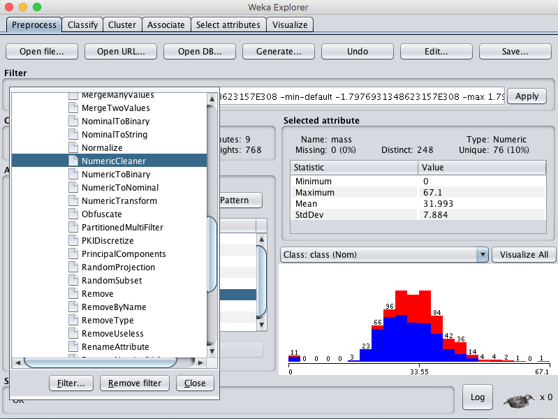
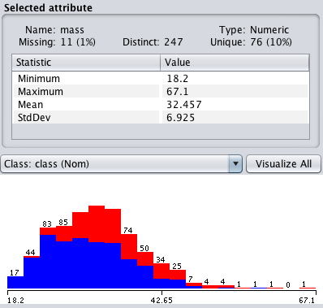

一般情况下，我们很难直接得到特别干净的数据，很多数据中都具有缺失值或者被污染的值。  
因此，在开发机器学习模型时，为了得到最好的性能，如何去**辨认**，**标记**并且**处理**缺失值就显得特别重要。  
在本文中你将会学会如何在你的机器学习数据上利用Weka去处理缺失值  
- 在阅读完本文你将会知道：  
    - 在数据集上如何去标记缺失值  
    - 如何从数据集中移除缺失值  
    - 如何填补缺失值  
# 预测糖尿病的发病  
本例中使用的问题是皮马印第安人糖尿病发病数据集。  
这是一个分类问题，每一行代表一个实例，一个实例就是一个病人的医疗细节。  
任务是去预测是否病人会在接下来的五年之内发病。  
本文来自于[如何用Weka处理缺失值](https://machinelearningmastery.com/how-to-handle-missing-values-in-machine-learning-data-with-weka/)  
- 你可以在下面的链接中了解到更多的关于此数据集的信息：  
    - [数据集文件](https://raw.githubusercontent.com/jbrownlee/Datasets/master/pima-indians-diabetes.csv)
    - [数据集详情](https://raw.githubusercontent.com/jbrownlee/Datasets/master/pima-indians-diabetes.names)  
你也可以在Weka的安装包中找到，路径在Weka安装路径的*data/*文件夹下，文件名为*diabetes.arff*  
# 标记缺失值
对于探索缺失值来说，皮马印第安人数据集是一个好的基础。  
一些属性例如血压(pres)，BMI(mass)有0值，这实际上是不可能的。这些都是必须手动标记的有损坏值和缺失值的例子。  
你可以在Weka中使用NumericalCleaner filter(过滤器)，下面的方法向你展示了如何使用这个filter在BMI(mass)属性上标记出11个缺失值。  
1. 打开Weka Explorer
2. 加载皮马印第安人糖尿病发病数据集*diabetes.arff*  
3. 在Filter选项卡下点击“Choose”按钮并选择NumericalCleaner，它在unsupervized.attribute.NumericalCleaner

4. 点击设置的filter进行配置

5. 设置attributeIndicies为6, 这表示当前将filter应用于mass属性所在的列,因为此时mass属性的索引是6。

6. 设置minThreshold为0.1E-8 (接近于0), 这是这个属性所允许的最小值。比这个值更小的值将会被设置minDefault所设置的值代替

7. 设置minDefault为NaN, 这表示未知并且将会代替小于minThreshold的值。

8. 在filter配置中点击“OK”按钮.

9. 点击“Apply”按钮去应用这个filter.

在“attributes” 面板上点击“mass”并回顾“selected attribute”面板的详情. 注意到原来为0的11个属性值现在全部被标记为缺失。

在这个例子中我们将阈值以下的值标记为缺失。

你可以将它们很容易的标记为特定的数值。您还可以在值的上下范围之间标记缺失值。

现在让我们来看看如何将带有缺失值的实例从数据中移除出去。

# 移除缺失值

现在你已经学会如何在你的数据中标记缺失值，现在你需要学习如何去处理它们。

处理缺失值的一种简单的方式是直接移除那些拥有一个或者多个缺失值的实例。

在Weka中你可以使用RemoveWithValues filter。

在上面标记缺失值之后，你可以使用下面的方法来移除缺失值。

1. 在Filter选项卡下点击“Choose”按钮并选择RemoveWithValues，它在unsupervized.instance.RemoveWithValues

2. 点击设置的filter进行配置

3. 设置attributeIndicies为6, 这是mass属性的索引。

4. 设置matchMissingValues为“True”.

5. 在filter配置中点击“OK”按钮.

6. 点击“Apply”按钮去应用这个filter.

在“attributes” 面板上点击“mass”并回顾“selected attribute”面板的详情. 注意到被标记为缺失值的11个属性值已经从数据集中移除了。

# 计算缺失值

带有缺失值的实例并非必须被移除，你可以用一些其他的值来替换缺失值。

这叫做填补缺失值。

通常情况下我们用数值分布的平均值来填充缺失值。在Weka中你可以使用ReplaceMissingValues filter.

在上面标记缺失值之后，你可以通过如下的方式来填补缺失值。

1. 在Filter选项卡下点击“Choose”按钮并选择ReplaceMissingValues，它在unsupervized.attribute.ReplaceMissingValues

2. 点击“Apply”按钮去应用这个filter.

在“attributes” 面板上点击“mass”并回顾“selected attribute”面板的详情.注意到被标记为缺失值的11个属性值已经被设置为分布的平均值。

# 总结

在这篇文章中，你发现了如何使用Weka处理机器学习数据集中的缺失值。

- 具体来说，你学会了：
    - 在数据集上如何去标记缺失值  
    - 如何从数据集中移除缺失值  
    - 如何填补缺失值

您还有任何关于处理缺失值或者这篇指南的问题吗，欢迎您通过我的邮箱联系我：A2711985388@163.com
本文翻译自[Jason Brownlee PhD](https://machinelearningmastery.com/how-to-handle-missing-values-in-machine-learning-data-with-weka/)
